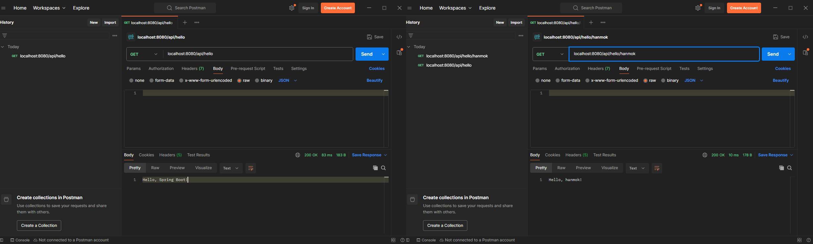
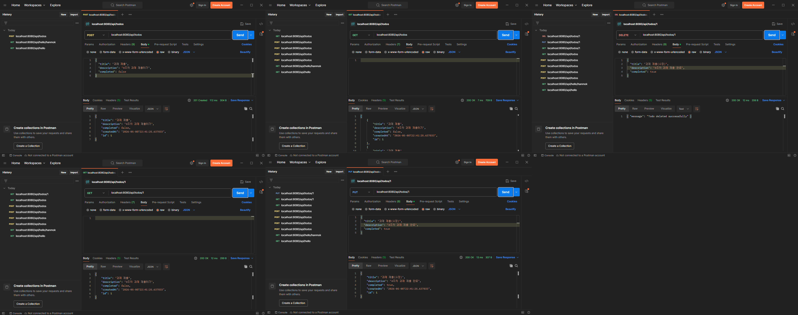

# 4주차 과제

## 프로젝트 정보

- **Framework**: Spring Boot 4.0.6
- **Build Tool**: Gradle (Groovy)
- **Language**: Java 21
- **Packaging**: Jar
- **설정 파일**: Properties

## Dependencies

### [과제 1]
- Spring Web
- Spring Boot DevTools

### [과제 2]
- Spring Web
- Spring Boot DevTools
- Spring Data JPA

## 실행 방법

터미널에서 아래 명령어를 입력하세요.

```
.\gradlew bootRun
```

## 실행 화면

### 과제 1



### 과제 2

